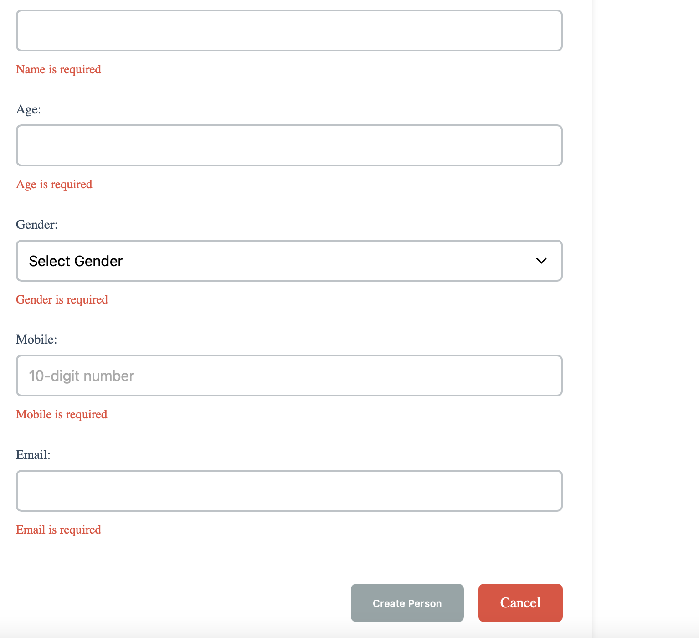
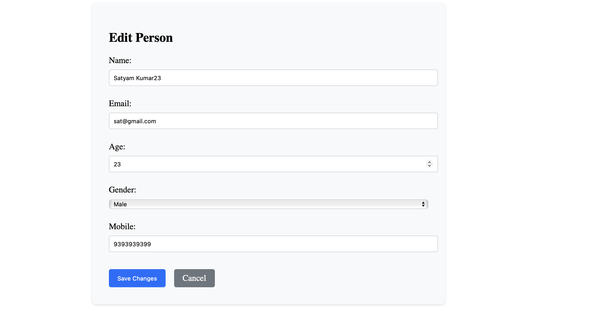
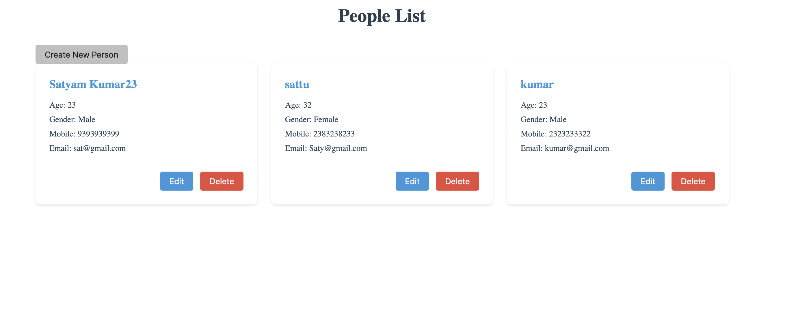

# Person Management App

## Overview
This is an **Angular 18** application for managing persons. It allows users to **create, edit, and list persons** with basic details like name, age, gender, mobile number, and email. The frontend is connected to a backend API for data management.

## Features
- **Create a new person**
- **Edit an existing person**
- **List all persons**
- **Backend integration** for data persistence

## Person Schema
```typescript
export interface Person {
  _id: string;
  name: string;
  age: number;
  gender: 'Male' | 'Female' | 'Other';
  mobile: string;
  email: string;
}
```

## File Structure
```
people-management/
│── src/app/
│   ├── app/
│   │   ├── create-person/
│   │   │   ├── create-person.component.html
│   │   │   ├── create-person.component.css
│   │   │   ├── create-person.component.ts
│   │   ├── edit-person/
│   │   │   ├── edit-person.component.html
│   │   │   ├── edit-person.component.css
│   │   │   ├── edit-person.component.ts
│   │   ├── people-list/
│   │   │   ├── people-list.component.html
│   │   │   ├── people-list.component.css
│   │   │   ├── people-list.component.ts
│   ├── models/
│   │   ├── person.model.ts
│   ├── services/
│   │   ├── person.service.ts
│   ├── other Angular default files
```

## Backend Connection
The frontend communicates with the backend using `person.service.ts`, which handles **API requests** to create, fetch, and update persons.

## Getting Started
### 1. Clone the Repository
```sh
git clone https://github.com/YOUR_USERNAME/YOUR_REPO_NAME.git
cd people-management
```

### 2. Install Dependencies
```sh
npm install
```

### 3. Run the Application
```sh
ng serve
```
Open `http://localhost:4200/` in the browser.

## Screenshots
Add screenshots of the application in action here.

Example:
<p align="center">
  
</p>
<p align="center">
  
</p>
<p align="center">
  
</p>


## Contribution
Feel free to fork the repository and submit pull requests.

## License
This project is licensed under the MIT License.

